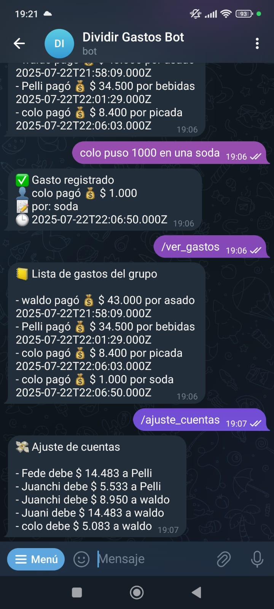
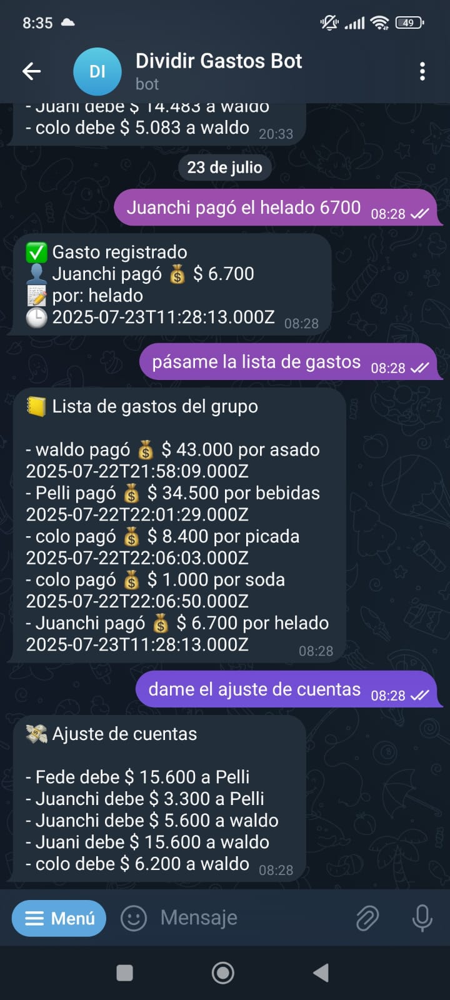

# 🤖 Bot de Gestión de Gastos Grupales

Este bot te ayuda a manejar gastos compartidos entre un grupo de personas. Recibe mensajes en lenguaje natural (vía Telegram u otra interfaz) y registra quién pagó, cuánto, por qué y entre quiénes se reparte.

Ideal para juntadas, viajes o cualquier situación donde haya que dividir gastos.

---

# Repo en progreso

---

## 🚀 ¿Qué hace?

- Forma un grupo de personas entre los que se repartirán los gastos.
- Interpreta mensajes como:
  > "Martín gastó 5000 en birras"
- Confirma cada gasto con detalle.
- Divide el monto automáticamente (entre todos, o según se indique).
- Lleva un historial de lo que se pagó y quién puso cuánto.

---

## ⚙️ Tecnologías

- **Backend:** [Express](https://expressjs.com/) + [TypeScript](https://www.typescriptlang.org/)
- **Base de datos:** [SQLite](https://www.sqlite.org/)
- **IA (actual):** [OpenAI GPT](https://openai.com/)
- **UI (actual):** [Telegram Bot API](https://core.telegram.org/bots/api)

La idea es que puedas cambiar fácilmente tanto la capa de IA como la interfaz de mensajería.

---

## Funciones

 - Crear un grupo de personas para compartir gastos (IA function_calling)
 - Agregar un gasto con: pagador, monto, descripción, entre cuantos se divide (IA function_calling)
 - Mostrar todos los gastos del grupo (IA function_calling y comando)
 - Mostrar los pagos para el ajuste de cuentas (IA function_calling y comando)
 - Cerrar el grupo para comenzar uno nuevo (comando)

---

## Ideas para implementar y cosas para mejorar

 - [x] Manejar múltiples gastos en un solo mensaje.
 - [x] Agregar manejo de creación de mensajes para respuestas del bot.
 - [ ] Agregar procesamiento de webhook async.
 - [ ] Soportar audio.
 - [ ] Soportar ediciones de gastos.
 - [ ] Formatear la fecha de manera amigable.
 - [ ] Ofrecer opción para agrupar la lista de gastos por persona.
 - [ ] Hacer a prueba de balas, testear contra inputs "malditos".

---

## Imágenes

Puedes probar el bot escaneando el código QR de la primer imagen.

  
  
  

