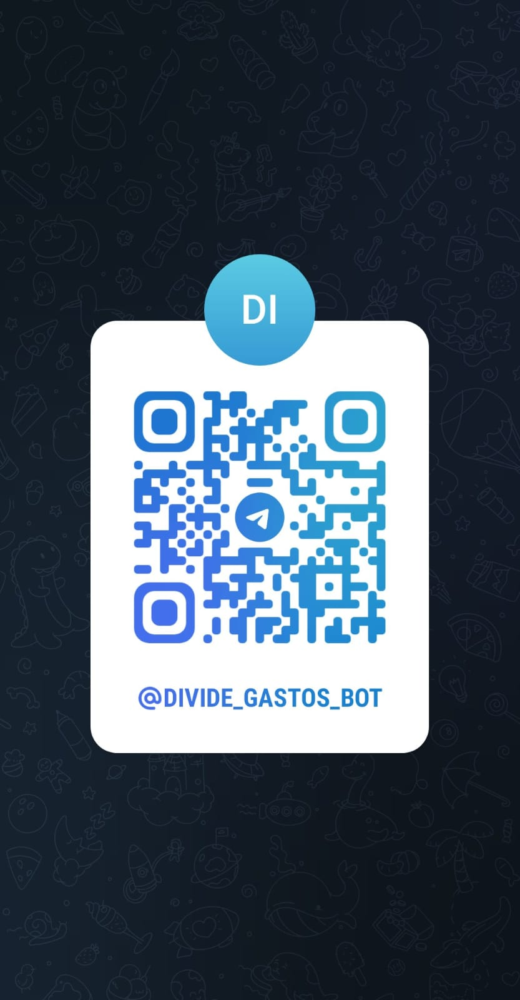
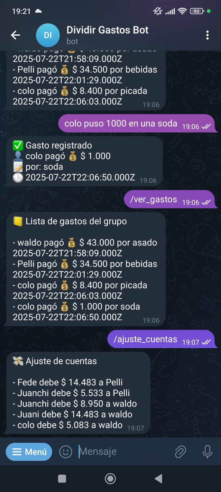
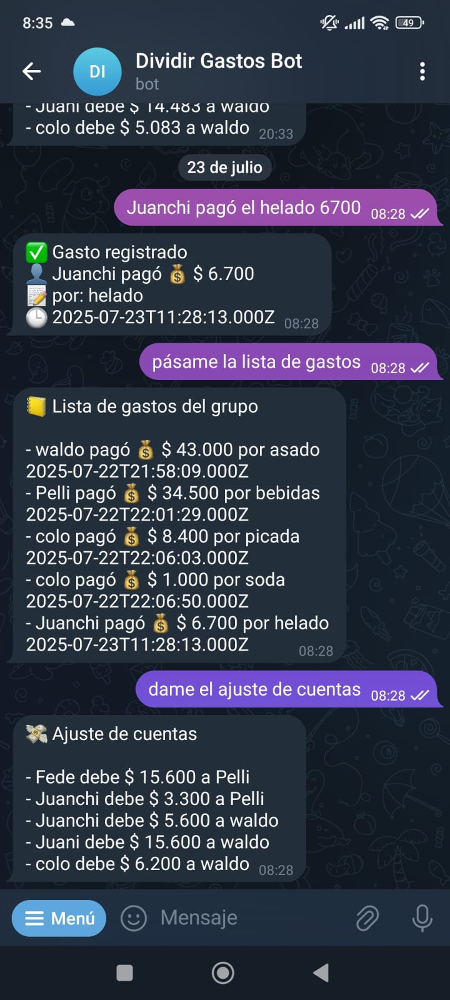

# Divide Expenses Bot

AI-assisted Telegram bot for tracking and splitting shared expenses from natural-language messages.

The bot lets a group record expenses conversationally, understand who paid, how much, what it was for, and how the cost should be split. It is useful for trips, meetups, dinners, or any situation where a group needs to keep track of shared spending without using spreadsheets.

## Overview

Instead of filling out forms, users can send messages like:

> Martín paid 5000 for beers

The bot interprets the message, extracts the relevant information, confirms the expense, stores it, and keeps track of what each person paid.

It can also calculate the final settlement so the group knows who should pay whom to balance everything out.

## Features

- Create a group of participants.
- Register expenses from natural-language messages.
- Detect payer, amount, description, and split participants.
- Handle multiple expenses in a single message.
- Confirm parsed expenses before saving them.
- Show the full expense history.
- Calculate settlement payments between group members.
- Close a group and start a new one.
- Persist data using SQLite.
- Process Telegram messages asynchronously.

## Tech Stack

- **Language:** TypeScript
- **Backend:** Express
- **Database:** SQLite
- **Messaging interface:** Telegram Bot API
- **AI:** OpenAI GPT with function calling
- **Queue / async processing:** BullMQ

## Technical Notes

The project is designed so the AI layer and the messaging interface can be replaced independently. Telegram is currently used as the main interface, but the core expense-management logic is separated from the transport layer.

Natural-language parsing is handled through OpenAI function calling. This allows the bot to convert informal user messages into structured actions, such as creating a group, adding an expense, listing expenses, or calculating settlements.

Message processing is handled asynchronously with BullMQ. For now, the worker uses sequential processing to preserve message order inside a chat, which is important when users send multiple expense-related messages in a row.

## Supported Actions

The bot currently supports:

- Creating a group.
- Adding expenses.
- Adding multiple expenses from one message.
- Listing all expenses.
- Calculating settlement payments.
- Closing the current group.

Some actions are available through both natural-language messages and explicit bot commands.

## Roadmap

Planned improvements:

- Improve concurrency handling across multiple chats.
- Add confirmation before closing a group.
- Support audio messages.
- Support adding or removing participants after group creation.
- Support editing existing expenses.
- Add grouped expense views by participant.
- Expand test coverage for ambiguous or malformed user inputs.

## Demo

You can try the bot by scanning the QR code in the first image.

  
  
  

